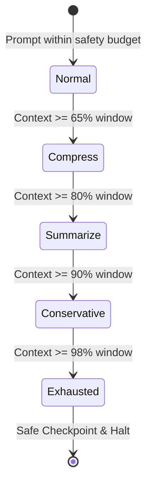

# SimpleIDE — Bounded Agent Runs & Context Architecture

## 1. Principles of Bounded Execution

Standard LLM coding agents suffer from unbounded context expansion, memory leaks, and runaway costs when operating on large codebases. In SimpleIDE Prime V2, agent execution is strictly bounded across four dimensions:
1. **Context Window Bounding:** Guaranteed prompt size within provider limits via staged context degradation.
2. **Tool Result Bounding:** Ephemeral vs. persistent tool output caching with pin caps and pointer summaries.
3. **Turn & Tool Budgeting:** Max turn caps (default 50) and consecutive malformed response circuit breakers (cap of 3).
4. **Transactional Rollback & Recovery:** Reversible disk operations and automated crash recovery reconciler.

---

## 2. Context Degradation Pipeline (`ContextBudgetManager.js`)

Before dispatching an LLM turn, the `ContextBudgetManager` inspects available tokens against the model's reported context window (via `MODEL_CAPABILITY_REGISTRY` in `LLMRouter.js`).



### Degradation Stages
1. **`normal`:** Full context included (all system prompts, open files, active selections, complete tool outputs, project symbol index).
2. **`compress`:** Strips redundant whitespace, shortens file previews to first 120 lines, truncates verbose terminal logs.
3. **`summarize`:** The `RollingSummarizer` compresses previous conversation turns into structured factual summaries (objectives, completed files, active constraints).
4. **`conservative`:** Drops non-essential context chunks (keeps only active file and system prompt); retains only the last 2 conversation turns.
5. **`exhausted`:** Emits a `BUDGET_EXHAUSTED` event, creates a full SQLite checkpoint, and halts the turn before the provider returns an HTTP 400 Context Window Exceeded error.

---

## 3. Tool Result Store (`ToolResultStore.js`)

Tool executions frequently return giant outputs (e.g. `npm test` logs, directory tree dumps, full file contents). Uncontrolled accumulation quickly overruns the LLM context.

### Lifecycle Tiers
- **`ephemeral`:** High-volume inspection outputs (e.g. file search matches, directory listings). Retained for 1 turn only, then evicted.
- **`recent`:** Regular command outputs and file reads. Retained for 3 turns.
- **`important`:** Errors, stack traces, and verification failures. Retained until addressed.
- **`persistent`:** Critical architectural facts and explicit user constraints. Never evicted.
- **`pinned`:** Manually or automatically pinned results. Subject to the `maxPinnedOutputChars` cap (12,000 characters). When exceeded, the store emits a pointer summary:
  ```text
  [tool output truncated: 45,820 chars total. Showing last 1,200 chars]
  ...
  ```

---

## 4. Crash Recovery & Checkpoint V2

### Database Schema & State Transitions
All agent runs, events, tool executions, file modifications, and plan steps are persisted transactionally in SQLite (`electron/database/DatabaseManager.js`).

### Startup Reconciliation (`CrashRecoveryService.js`)
When a workspace is loaded, the `CrashRecoveryService` checks for runs left in `EXECUTING` or `PLANNING` states (indicating an abnormal termination, power outage, or IDE crash):
1. **Query:** Fetches all unfinished runs matching the workspace ID.
2. **Disk Audit:** Inspects all recorded file modifications against the actual filesystem using `fs.readFile` and SHA-256 hashes.
3. **Plan Step Reconciliation:** Marks completed steps as verified if the generated files exist on disk; flags missing files as pending/reverted.
4. **Checkpoint Emitted:** Constructs a safe resumption checkpoint and restores the agent UI state with a "Resume Agent Task" review card.
