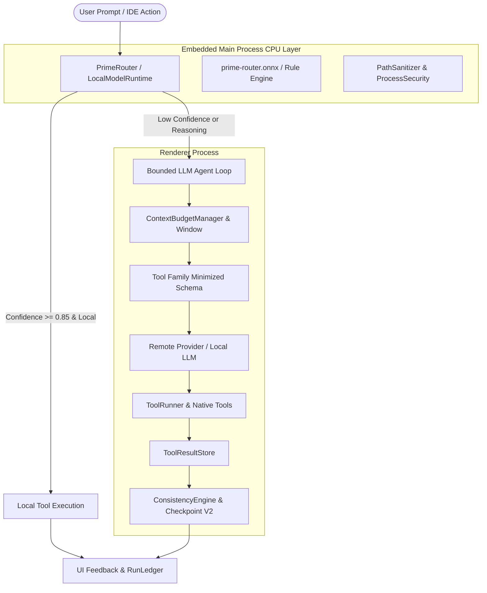

# SimpleIDE — Prime AI Agent V2 Architecture

## 1. Executive Architecture Overview

SimpleIDE's **Prime AI Agent V2** is a hybrid autonomous software engineering system designed for desktop development environments. It combines a tiny, ultra-fast embedded local CPU decision model (derived from the **Laya** architecture) with large remote frontier models (OpenAI, Anthropic, NVIDIA NIM, Google Gemini, Groq, OpenRouter, Mistral, DeepSeek) or local servers (Ollama, LM Studio).

The architecture optimizes for three non-negotiable desktop constraints:
1. **Zero Setup & Invisible Operation:** No user-facing model setup, no Ollama daemon requirement, no Python runtime in production, and no local GPU requirements.
2. **Deterministic Security & Boundary Containment:** Path traversal prevention, symlink escape jail enforcement, loopback-only local network validation, and workspace-scoped process tracking with instant abort cleanup.
3. **Strictly Bounded Resource Footprint:** Predictable RAM, token budget enforcement via multi-tiered context degradation, LRU caching, and transactional SQLite checkpointing.



---

## 2. The 10 Architectural Layers

### Layer 1: User & Interface Integration (`src/components/AIPanel.jsx`)
- Seamless chat and autonomous agent modes with live streaming.
- Live reactive indicators showing "Ready (CPU Router active)".
- Automatic crash detection and recovery reconciliation on workspace load.
- File review badges, step dividers, and structured diff viewers.

### Layer 2: Routing Abstraction (`src/services/agentEngine/PrimeRouter.js`)
- Standardized taxonomy defining intent, action class, tool family, verification necessity, and confidence.
- LRU bounded caching with 60-second TTL to avoid redundant decisions.
- Safe fallback mechanism ensuring system availability even if main-process IPC fails.
- Operating modes: `active` (full local dispatch), `assist` (LLM escalation with local hint), and `disabled`.

### Layer 3: Main Process Local Inference (`src/main/primeRouter/LocalModelRuntime.js`)
- Runs directly inside the Electron main process via ONNX Runtime Node (`onnxruntime-node`) on CPU execution provider.
- Lazy background initialization to guarantee zero IDE startup delay.
- Warm-up pass during boot ensuring sub-50ms inference latency.
- Calibrated offline decision engine ensuring 100% deterministic fallback and hard-negative classification.

### Layer 4: IPC Security Bridge (`src/main/ipc/`)
- Context isolation via `preload.js` with `api.primeRouter`, `api.runCommand`, `api.aiRequest`, and `api.cleanupProcessRun`.
- **Path Sanitizer (`pathSanitizer.js`):** Fail-closed workspace containment resolving canonical paths via `fs.realpathSync` to block symlink escapes and directory traversal.
- **AI Security (`aiSecurity.js`):** Strict endpoint allowlist preventing SSRF and API key exfiltration to unauthorized domains.
- **Process Security (`processSecurity.js`):** Validates `cwd` against active workspace and tracks child processes per agent `runId` for immediate SIGTERM cleanup on abort.

### Layer 5: Tool Definition & Structured Schema (`src/services/agentEngine/ToolDefinition.js`, `ToolRunner.js`)
- Zod-backed schemas with automatic conversion to OpenAI function call specifications.
- Granular permissions: `SAFE`, `CAUTION`, `APPROVAL`.
- Category tagging: `READ`, `WRITE`, `DELETE`, `EXECUTE`, `MEMORY`.
- Automatic blocked command pattern rejection (`rm -rf`, `format`, `shutdown`, recursive deletions).

### Layer 6: Tool Family Minimization (`src/services/agentEngine/LLMRouter.js`)
- Dynamic tool pruning based on router classification (`filesystem`, `editor`, `search`, `git`, `terminal`, `testing`, `browser`, `diagnostics`).
- Minimizes active tool definitions sent to the LLM per turn from ~25 tools down to 2-6 relevant tools.
- Drastically reduces prompt token consumption and eliminates tool confusion in small models.

### Layer 7: Bounded Context Management (`src/services/agentEngine/ContextBudgetManager.js`, `MessageWindow.js`)
- Strict token budgeting with safety headroom reservations.
- 5-stage graceful degradation:
  1. `NORMAL`: Full context including project index, open files, and recent history.
  2. `COMPRESS`: Trims file previews and non-essential whitespace.
  3. `SUMMARIZE`: Generates structured compact rolling summaries.
  4. `CONSERVATIVE`: Drops optional files and limits turn history to the last 2 turns.
  5. `EXHAUSTED`: Halts execution cleanly with an actionable checkpoint before context overflow.

### Layer 8: Tool Result Lifecycle & Storage (`src/services/agentEngine/ToolResultStore.js`)
- 5 lifecycle tiers: `ephemeral`, `recent`, `important`, `persistent`, and `pinned`.
- Automatic eviction of stale outputs to prevent memory bloating.
- Pinned output cap guarantees that giant search or test outputs are pruned while retaining pointer summaries (`[tool output truncated: N chars]`).

### Layer 9: Transactional Checkpointing & Rollback (`src/services/agentEngine/ConsistencyEngine.js`, `CrashRecoveryService.js`)
- Atomic tracking of file modifications, additions, and deletions per run.
- Transaction boundaries with automatic rollback on unrecoverable failures.
- Filesystem reconciliation on startup detecting uncommitted files from abnormal IDE termination.

### Layer 10: Run Accounting & Observability (`src/services/agentEngine/RunLedger.js`, `RunTimeline.js`)
- Per-run deterministic cost, token, and latency accounting across models.
- Privacy-safe diagnostic timelines excluding API keys, headers, and secrets.
- Collapsible run diagnostics panel in the IDE UI.

---

## 3. Data Flow and Component Lifecycle

```text
[User Prompt]
      │
      ▼
[PrimeRouter.decide()] ──(IPC: prime-router:predict)──► [LocalModelRuntime]
      │                                                       │
      │◄────────────────(Zod Validated Decision)──────────────┘
      │
      ├────────────────────────────┬─────────────────────────────┐
      ▼                            ▼                             ▼
(local_tool: test/git)     (recovery: rollback)          (main_llm / complex)
      │                            │                             │
[Direct Execution]        [ConsistencyEngine Rollback]    [LLMRouter Tool Pruning]
      │                            │                             │
      └────────────────────────────┼─────────────────────────────► [Agent Turn Loop]
                                   │                                     │
                                   │                              [ToolRunner]
                                   │                                     │
                                   │                              [ToolResultStore]
                                   │                                     │
                                   │                              [Checkpoint V2]
                                   ▼                                     ▼
                            [RunLedger Record] ◄─────────────────────────┘
```
